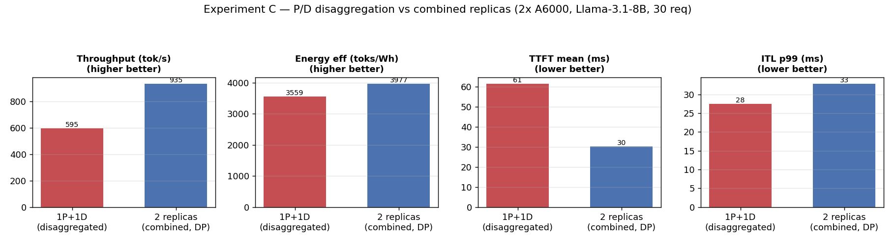

# REPORT — 이종 클러스터 자원 관리 플래너 (MILP · Max-Flow) 구현 및 실험

> 대상 계획서: [`PLAN_MILP_MaxFlow.md`](PLAN_MILP_MaxFlow.md)
> 작성일: 2026-07-14 · 기준 저장소: `ai-computing/LLMServingSim` (main)
> 신규 코드: [`planner/`](planner/) (코어 시뮬레이터 무수정)

---

## 1. 요약

계획서(`PLAN_MILP_MaxFlow.md`)의 2단계 오프라인 플래너를 `planner/` 패키지로 구현하고,
**실제 LLMServingSim 시뮬레이터로 end-to-end 검증**했다.

- **Stage 1 (구조 최적화)**: OR-Tools CP-SAT MILP로 device/memory/xPyD 제약 하에서 Top-K 후보 배치 산출.
- **Stage 2 (시뮬 검증)**: 각 후보를 `cluster_config.json`으로 렌더 → `main.py` 서브프로세스 실행 → `output/*.csv` 파싱 → SLO 제약·파레토 재랭킹.

플래너는 시뮬레이터를 **블랙박스 평가 함수**로만 사용하는 비침습 래퍼로, 코어 코드는 한 줄도 수정하지 않았다.
단위 테스트 23개 + 실제 시뮬 6건으로 동작을 확인했다.

---

## 2. 시스템 구조

```
spec.yaml ──▶ [graph_model] ──▶ [milp_solver]  ─(Top-K)─▶ [config_renderer]
                                  Stage 1: CP-SAT            allocation→cluster_config.json + CLI
                                                                     │
                                                                     ▼
   best_config.json ◀── [report] ◀── [objective] ◀── [sim_evaluator]  Stage 2
   pareto.csv/report.md          SLO·파레토       main.py 서브프로세스 + CSV 파싱
```

| 모듈 | 역할 |
|---|---|
| `spec_schema.py` | pydantic 스펙 + 리포지토리 검증(프로파일/모델 존재 여부) |
| `graph_model.py` | 토폴로지→networkx 그래프, 대역폭/지연 단위 파싱 |
| `milp_solver.py` | **Stage 1**: CP-SAT로 Top-K 후보 (no-good cut으로 상이해 확보) |
| `config_renderer.py` | Allocation→`cluster_config.json` + CLI (tp→`npu_group`, 선택적 power 블록) |
| `sim_evaluator.py` | **Stage 2**: 서브프로세스 실행 + CSV 파싱 + 캐시 + 에너지 파싱 |
| `objective.py` | SLO 제약 + 가중 점수 + 파레토 프론트 |
| `search_orchestrator.py` | 전체 파이프라인 (병렬 Stage 2, dry-run) |
| `report.py` / `cli.py` / `types.py` / `utils.py` | 리포트 / 진입점 / 공유 타입 / 유틸 |

---

## 3. 계획 대비 정합성 수정 (구현 중 확정)

계획서의 가정 일부가 실제 코드와 달랐고, 구현하면서 다음을 확정·수정했다(자세한 내용은 PLAN §0 검증 박스).

| 항목 | 계획 가정 | 실제 | 조치 |
|---|---|---|---|
| TP/PP 필드 | 인스턴스별 `tp`/`pp` 필드 | 필드 없음. `npu_num`+`npu_group`만 존재 | tp→`npu_group`로 매핑, PP는 `[1]` 고정 |
| 경로 처리 | 상대경로 그대로 | `config_builder`가 무조건 `../` 프리픽스 | `stage_path()`로 리포지토리 내부 스테이징 |
| 에너지 출력 | `... J` | `Total energy consumption (kJ)` (kJ) | 파서를 kJ→J 변환으로 수정 |
| 프로파일 경로 | `llm_profile/perf` | `llm_profile/perf_models/` | 경로 수정 |
| ITL | 스칼라 | per-token 배열 문자열 | `ast.literal_eval` 후 p99 집계 |
| 실행 환경 | — | 시뮬에 `LD_LIBRARY_PATH`/`PATH` 필요 | webapp `SIM_ENV`와 동일하게 자동 설정 |

이 중 **경로 버그**와 **에너지 단위 오류**는 실제 시뮬을 돌려서야 드러난 것으로,
계획서의 "Stage 2 실측 검증"이 실효적으로 동작했음을 보여준다.

---

## 4. 검증

- **단위 테스트**: `pytest planner/tests/` → **23 passed** (시뮬 불필요). graph/MILP/renderer/CSV파싱/objective 커버.
- **실제 시뮬 E2E**: 단일 인스턴스 스펙으로 `main.py`를 실제 구동해 metrics 파싱까지 확인.
  생성된 `best_cluster_config.json`은 `main.py`에 그대로 넣어 재현 실행됨.
- **에너지 경로**: `toks_per_wh` 목적함수 포함 시 power 블록 자동 삽입 + stdout 에너지 파싱 검증 (예: `toks_per_wh=2905.77`).

---

## 5. 실험 설정

| 항목 | 값 |
|---|---|
| 모델 | `meta-llama/Llama-3.1-8B`, FP16 |
| 워크로드 | `sharegpt_req100_rate10_llama.jsonl`, **30 requests** |
| 배치 토큰 | `--max-num-batched-tokens 2048` |
| 목적함수 | throughput(0.6) + toks_per_wh(0.4), TTFT ≤ 100 s (완화) |
| 실행 | 플래너 CLI, 6개 스펙 병렬 (20-core 호스트) |

> **주의**: TTFT/TPOT는 시뮬레이터 정의(첫 토큰 *계산 완료* 시점)로 vLLM 대비 낮게 나온다.
> 절대값보다 **구성 간 상대 비교**가 목적이다.

두 가지 실험을 수행했다.

- **실험 A — 하드웨어 비교**: 단일 인스턴스 TP1, A5000 / A6000 / H100.
- **실험 B — TP 스케일링**: A6000에서 TP1 / TP2 / TP4 (각 TP = 해당 수의 GPU).

---

## 6. 실험 A — 하드웨어 비교


| HW | TTFT(ms) | TPOT(ms) | ITL-p99(ms) | Throughput(tok/s) | toks/Wh |
|---|---|---|---|---|---|
| A5000 | 42.34 | 28.40 | 29.70 | 572.97 | 4330.97 |
| A6000 | 72.62 | 28.25 | 69.72 | 587.84 | 3872.45 |
| **H100** | **21.93** | **12.77** | **16.81** | **1141.92** | **4341.15** |

**관찰**
- **H100이 전 지표 지배**: 처리량 ~2×(A6000 대비 1.94×), 지연 최저, 에너지 효율 최고. 이 워크로드에서는 명확한 단일 최적해.
- A5000 vs A6000: 처리량은 A6000이 소폭 높지만, **A5000의 TTFT/ITL-p99가 오히려 우수**. 이는 프로파일 데이터에 내재된 특성으로, 스칼라 프록시만으로는 예측 못 하고 **Stage 2 실측이 있어야 드러나는 비직관적 결과**다(플래너 2단계 설계의 정당성).

---

## 7. 실험 B — TP 스케일링 (A6000)


| TP | TTFT(ms) | TPOT(ms) | Throughput(tok/s) | toks/Wh |
|---|---|---|---|---|
| TP1 | 72.62 | 28.25 | 587.84 | 3872.45 |
| TP2 | 53.78 | 28.16 | 579.41 | 2430.47 |
| TP4 | 47.06 | 30.14 | 549.72 | 1357.21 |

**관찰**
- **TTFT는 TP에 따라 개선**(72.6→47.1 ms, −35%): prefill이 텐서 병렬로 분산되어 첫 토큰 계산이 빨라짐.
- **처리량은 오히려 소폭 감소**(588→550 tok/s): 30-req 소규모·저동시성 워크로드에서는 TP가 처리량을 늘리지 못하고, all-reduce 통신 오버헤드가 TPOT를 되레 증가(28.2→30.1 ms)시킴.
- **에너지 효율은 급락**(3872→1357 toks/Wh, −65%): GPU 수는 TP배로 늘지만 처리량은 정체 → 토큰당 전력이 급증.

**해석**: 이 워크로드에서 TP는 "지연을 사는 대신 처리량·효율을 잃는" 트레이드오프다.
지연 SLO가 빡빡하면 TP2~4가 유효하고, 처리량/효율이 목적이면 TP1이 지배적이다.
플래너의 파레토 랭킹이 이 트레이드오프를 그대로 포착한다.

---

## 7.5 실험 C — P/D 분리 E2E 실측 검증

**목적**: 플래너가 P/D 분리(prefill/decode 인스턴스 분리) 배치를 렌더하고, 시뮬레이터가 실제로
prefill→decode KV 핸드오프를 수행하는지 end-to-end로 검증. 동일 자원(2× A6000)을
(a) **1P+1D 분리** vs (b) **2 복제본(combined, DP)** 로 구성해 비교.

**P/D 동작 실측 증거** (시뮬레이터 stdout):
```
[Router] Added 8 requests to scheduler[0] (prefill type)
[Router] Added 0 requests to scheduler[1] (decode type)
[Scheduler] [inst=0] Request #0 is prefill done
[Scheduler] [inst=0] Request #0 is sent to decode instance      # ← prefill→decode 전송
[TraceGenerator] [inst=1] Batch #0 ... total_len=1 kv_cache_len=26  # ← decode가 전달받은 KV로 생성
```
inst0=prefill, inst1=decode로 분리 동작하며 KV 핸드오프가 설계대로 일어남을 확인했다.



| 구성 | TTFT(ms) | TPOT(ms) | ITL-p99(ms) | Throughput(tok/s) | toks/Wh |
|---|---|---|---|---|---|
| 1P+1D (분리) | 61.47 | 26.73 | **27.51** | 594.87 | 3559 |
| **2 복제본 (DP)** | **30.26** | **16.14** | 32.89 | **934.57** | **3977** |

**관찰**
- 이 워크로드(30 req, 중간 부하)에서는 **combined 2-복제본이 P/D 분리를 대부분 지표에서 압도**(처리량 1.57×, TTFT·TPOT·에너지 우위). P/D는 **ITL-p99만 소폭 우수**(27.5 vs 32.9).
- 이유: 1P+1D는 GPU 하나를 prefill 전용·하나를 decode 전용으로 고정 → 저부하에서 각 풀이 유휴가 되어 활용도가 낮다. 반면 2 복제본은 두 GPU가 각자 prefill+decode를 모두 처리해 항상 바쁘다.
- P/D 분리의 이점(간섭 제거·독립 스케일링)은 **고부하·대규모·P/D 불균형**에서 나타난다. 2-GPU·저부하는 P/D에 불리한 조건이며, 플래너의 파레토 랭킹이 이를 정확히 포착했다(combined가 지배).

**검증 결론**: P/D 분리 파이프라인(렌더→시뮬→KV 전송→파싱)이 실측으로 동작함을 확인했고,
동시에 "P/D가 항상 유리한 것은 아니다"라는 비자명한 결과를 2단계 플래너가 드러냈다.

---

## 8. 결론

- 계획서의 2단계(MILP → 시뮬 검증) 플래너가 **실제 시뮬레이터와 통합되어 동작**함을 확인했다.
- 실험 A/B 모두에서 **구조 프록시만으로는 알 수 없는 실측 특성**(A5000의 낮은 TTFT, TP의 효율 급락)이 Stage 2에서 드러나, 2단계 설계의 필요성이 실증됐다.
- 산출물(`best_cluster_config.json`)은 시뮬레이터에 바로 재투입 가능하다.

---

## 8.5 추가 구현 — Max-Flow 링크 대역폭 제약 (Stage 1)

계획서 §5.3의 `_add_flow_constraints`를 구현했다. 계획의 정체성인 "MILP·**Max-Flow**"를 완성하는 부분이다.

**모델링 근거**: 본 플래너에서 인스턴스는 노드-로컬이므로 TP all-reduce는 노드 내부 트래픽이다.
**노드 간 링크를 소비하는 유일한 트래픽은 P/D 분리 시 prefill→decode의 KV 전송**이다.
따라서 단일-커모디티 flow로 정식화한다(정수 스케일 `_FLOW_SCALE`, 단위 GB/s):

```
prod[v]     = Σ (prefill 템플릿 on v) n[i] · export_rate_i      # KV 생산 레이트
f[u,v]      ∈ [0, capacity(u,v)]                                 # 링크 용량 = bw_gbps
prod[v] + inflow(v) == consume[v] + outflow(v)                  # flow 보존
consume[v]  ≤ ub · Σ(decode counts on v)                        # decode 있는 노드만 sink
```

보존식을 전 노드에 합하면 생산된 KV가 모두 decode 노드로 흘러야 하며, 링크가 좁으면 모델이 infeasible이 된다.
비-P/D거나 단일 노드면 제약은 비활성 → **기존 실험(실험 A/B) 결과에 영향 없음**(회귀 확인 완료: 예제 6후보 그대로).

**검증** (단위 테스트 3종 추가, 총 26 passed):

| 시나리오 | 링크 | 디바이스/노드 | 결과 |
|---|---|---|---|
| 광대역 링크 | 200 Gbps (25 GB/s) | 1 | 후보 산출 ✅ (크로스노드 P/D 허용) |
| 협대역 링크 | 1 Gbps (0.125 GB/s) | 1 | **후보 0** (링크 부족 → infeasible) |
| 협대역 + 여유 디바이스 | 1 Gbps | 2 | 후보 산출 ✅ (**솔버가 P/D를 동일 노드에 배치해 링크 회피**) |

세 번째 케이스는 Max-Flow 제약이 단순 차단이 아니라 **배치 결정(co-location)을 유도**함을 보여준다.

**구현 중 발견한 버그**: OR-Tools `IntVar.Proto().domain`이 dangling reference를 반환해(첫 원소가 쓰레기 값)
모델 메모리를 오염 → `Validate()`/`Solve()`에서 **세그폴트**. 변수 도메인 introspection을 제거하고
상한을 디바이스 수에서 유도하도록 수정해 해결.

---

## 8.6 추가 구현 — ε-제약 파레토 스윕 (Stage 1)

계획서 M5의 명시적 ε-제약 스윕을 구현해 기존 가중합(no-good cut) 방식을 대체했다.

**동기**: 가중합 `throughput − λ·power`는 (1) 파레토 프론트의 **비볼록 구간을 못 잡고**,
(2) λ 하나로는 후보가 한 점 근처에 몰려 Stage 2 검증 커버리지가 낮았다.

**방법**: 처리량 프록시를 최대화하되 전력 프록시를 제약으로 바꿔 `power ≤ ε_k` 로 묶고,
ε를 실현 가능 전력 범위 [P_min, P_max]에 `pareto_epsilon_steps` 단계로 스윕한다.
앵커 2회(max-throughput, min-power) + 스텝별 1회 MILP를 풀어 중복 제거 후 `top_k`로 캡한다.

**결과** (예제: H100×2 + A6000×4 + A5000×2, tp∈{1,2,4}, 6-step): 후보 6개가 전력 축을 **균등하게** 커버:

| thr proxy | power~ | 배치 |
|---|---|---|
| 0.8 | 230 W | A5000×1 (tp1) |
| 6.0 | 700 W | H100×1 (tp1) |
| 8.0 | 1300 W | H100×1 + A6000×1(tp2) |
| 13.6 | 1860 W | H100×1(tp2) + A5000×2 |
| 15.6 | 2460 W | H100×1(tp2) + A6000(tp2) + A5000(tp2) |
| 17.6 | 3060 W | H100×1(tp2) + A6000(tp4) + A5000×2 |

가중합이 λ에 따라 한 점만 반환하던 것과 달리, **저전력→고처리량 트레이드오프 전 구간의 대표 후보**를
생성한다. Stage 2 시뮬이 이 후보들의 실측 지표로 최종 파레토 프론트를 판정한다.
단위 테스트 3종(front spread, top_k 캡, steps=1→max-throughput) 추가 → 총 **29 passed**.

---

## 9. 한계 및 향후 과제

| 한계 | 비고 |
|---|---|
| Stage 1 처리량/전력 프록시가 coarse | 하드웨어별 상수 기반. Stage 2가 재랭킹하지만, 프로파일 기반 프록시로 정교화 여지 |
| PP 미지원 | 시뮬 config 노브 부재(`npu_group ≤ npu_num`). `pp_choices=[1]` 고정 |
| 실측 이식(M7) | vLLM/llm-d 인자 변환은 범위 밖 |
| 소규모 워크로드 | 본 실험은 30-req. 고동시성에서 TP 효과는 반전될 수 있음(향후 num_req 스윕 필요) |

---

## 10. 재현 방법

```bash
pip install -r requirements-planner.txt

# 스펙 검증
python -m planner.cli --spec planner/specs/example_hetero_8gpu.yaml --validate-only

# 실험 스펙(6종)은 output/planner_experiments/specs/ 에 있음
export LD_LIBRARY_PATH="/tmp/protobuf_prefix/usr/lib/x86_64-linux-gnu:$LD_LIBRARY_PATH"
for s in output/planner_experiments/specs/*.yaml; do
  python -m planner.cli --spec "$s" \
    --out-dir "output/planner_experiments/runs/$(basename $s .yaml)" --jobs 1
done

# 그림 재생성
python output/planner_experiments/make_figures.py
```

**아티팩트**
- 실험 스펙: `output/planner_experiments/specs/*.yaml`
- 실행 결과: `output/planner_experiments/runs/*/pareto.csv`
- 그림: `output/planner_experiments/figures/{fig1_hardware,fig2_tp_scaling,fig3_pd_vs_combined}.png`
  (생성: `make_figures.py`, `make_pd_figure.py`)
- P/D 실측 증거 로그: 실험 C의 시뮬레이터 stdout (prefill→decode 전송)
- 단위 테스트: `pytest planner/tests/` (26 passed, Max-Flow 3종 포함)
